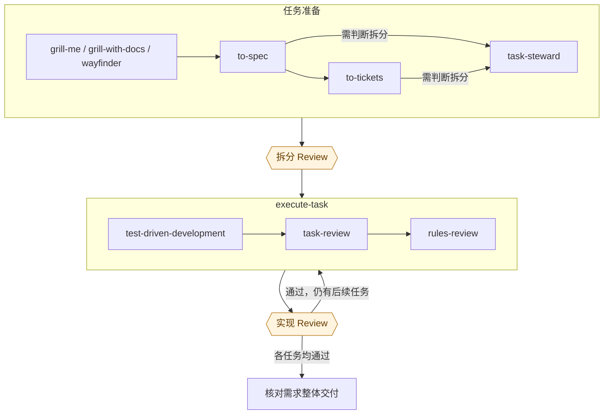

# 项目总览

一次开发会遇到不同性质的问题：需求还没想清楚、任务太大、实现有遗漏，或者已有项目约定需要调整。它们需要不同的处理方式。把这些工作分清楚，AI 才能在明确的范围内持续推进，人也能在真正需要作决定的地方介入。

这套开发方式组合了 [Matt 的 skills](https://github.com/mattpocock/skills)、[Superpowers](https://github.com/obra/superpowers) 和本仓库的 skills。Matt 提供需求探索、领域建模和任务准备的方法；Superpowers 的 `test-driven-development` 指导实现；本仓库负责把任务执行、审查返修、架构与规则维护衔接起来。

本文解释这些部分为什么存在、如何配合。每个 skill 的具体执行要求以它自己的 `SKILL.md` 为准。

先按需要使用准备阶段的 skills，再逐项交付任务。

图中斜杠分隔的入口有各自的用途：只需要通过访谈澄清计划或设计时，可以使用 `grill-me`；在项目开发中还需要同步维护领域语言、`CONTEXT.md` 和 ADR 时，使用 `grill-with-docs`；探索本身复杂、方向未明且一个会话无法理清时，使用 `wayfinder`。在本组合流程中，需要跨会话实现的工作按 `to-spec`、`to-tickets` 的顺序准备；目标、范围和验收已经明确且无需拆分的小任务，可以直接使用 `execute-task`。

图中的两次 Review 由人完成：拆分结果通过后开始首个任务；每个任务的实现结果通过后，才开始依赖它的下游任务。使用 `execute-task` 时，在交接中指定 `test-driven-development` 作为实现方法；两类独立审查及必要的返修由它组织。独立的集成或组合验证作为平级 task，由调用方按前置依赖安排执行。最终整体交付核对由调用方组织，不因 task 完成而自动通过。

代码问题回到当前任务返修，拆分问题回到 `task-steward`，需求问题回到需求 / Spec 层澄清；需要补充决定或证据时，由调用方组织处理。

## 先让任务有共同依据

开发开始时，最有价值的产出往往是一个明确的决定。预期行为、范围和验收方式越清楚，后续实现与审查就越少依赖猜测。

只需要通过访谈澄清计划或设计时，可以使用 Matt 的 `grill-me`，它调用 `grilling`。在项目开发中还需要同步维护领域语言、`CONTEXT.md` 和 ADR 时，使用 `grill-with-docs`，它结合 `grilling` 与 `domain-modeling` 完成这些工作。需要外部事实时可以用 `research`，需要观察交互或状态模型才能决定时可以用 `prototype`。这些方法服务于当前未决问题，按需要使用。

当探索本身很大、方向尚未明确，无法在单个会话中理清时，`wayfinder` 建立决定地图，把未决问题组织成可逐项解决的决定票据。每张票据保存相应问题的结论，地图索引这些决定。在本组合流程中，探索收敛后需要进入后续开发时，从 `to-spec` 接入需求说明与任务准备。

需要跨会话实现时，先用 `to-spec` 将讨论或决定地图中的结论整理为需求说明（Spec），包含预期行为、范围以及实现和测试方面的决定；再用 `to-tickets` 生成开发任务（Ticket），明确各项交付及前置依赖。它们把讨论中的共同理解带给后续参与者。

本仓库的 [task-steward](task-steward.md) 判断已有需求是否需要拆分，不限定来源或载体。先从当前实现及已确认契约出发，沿候选依赖推演各项交付与后续接入，再由自然实现闭环、核心状态或模块耦合、生命周期、真实依赖顺序及后续设计重开关系形成任务边界，再根据关键未知、发布或回滚风险及拆分造成的工程问题修正边界，最后检查任务承诺、结果能否验证与审查。验证与审查只检查边界，不负责生成边界；正常交接成本不否定已成立的自然实现边界。每个新形成或调整的候选都在本轮重新进入完整判断，父范围的 `needs-split` 不使新候选默认成为 `ready`。调用方指定的根需求保持不变，必要调整整理为其下的同一平级集合；集合检查明确前项成果、后项消费与扩展方式及连接工作的归属，判断各项如何组成完整能力。每个最终候选的重要内部边界均已评估、无需进一步拆分且通过边界检查，集合的实现承接、覆盖与依赖等检查通过，且无未决阻塞时，当前划分才算收敛。缺决定性信息的范围保留 `cannot_verify` 并阻断整体收敛，其余范围继续复核。

各范围分别标为 `ready`、`needs-split` 或 `cannot_verify`；原需求无需拆分时保留原需求并说明判断，不生成 task，缺决定性信息的范围保留未决。已有落实授权时，沿用项目约定或调用方指定载体写入明确的平级 task，区分当前划分收敛、局部落实与整体拆分完成。

任务拆分及 AI 拆分评审收敛后，调用方将整体拆分结果交给人 Review。人确认任务边界、需求覆盖、依赖、交付顺序和整体方向符合预期后，再开始首个任务。`task-steward` 的 AI 评审为这次人工 Review 提供依据。

这些准备工作做到足以支持当前任务即可。一个无需拆分且已经明确目标、范围和验收的小任务，可以直接进入执行；复杂需求则可能需要多次讨论和拆分。

## 让实现方法与执行组织各负其责

一个任务明确之后，仍有实现、验证、审查和返修需要协调。[execute-task](execute-task.md) 负责组织这一段工作：把任务交给实现者，安排独立审查，根据结果继续推进或把问题交回调用方。调用方可以是你，也可以是负责安排工作的上游流程。

这里把 Superpowers 的 `test-driven-development` 作为实现方法，在任务交接时明确给实现者。先写测试表达预期行为，运行并确认它因预期原因失败，再写最小实现使测试通过；需要重构时保持测试通过。这个循环让实现过程持续获得反馈，并为后续修改留下回归验证。

测试的行为和边界承接上游已经作出的决定。难以定位的故障还可以借助 Matt 的 `diagnosing-bugs` 建立复现、缩小问题并验证原因。

这两类职责分开后，使用者可以清楚地区分：`execute-task` 组织任务怎样流转，TDD 等方法指导实现者怎样完成工作。Implementer 是实现角色；本文的实现方法选择是 Superpowers 的 `test-driven-development`，具体交接时使用这个名称。

## 用不同依据检查同一份实现

测试给出已编码行为的验证结果。审查还需要检查要求是否遗漏、设计是否带来具体维护成本，以及项目规则是否得到遵守。因此，`execute-task` 在实现提交后依次安排两类独立审查：

| 审查 | 判断依据 | 关注的问题 |
| --- | --- | --- |
| [task-review](task-review.md) | 原始任务、已有契约和具体设计事实 | 要求是否正确实现，是否有回归或越界行为，设计是否增加理解、修改或验证成本。 |
| [rules-review](rules-review.md) | 项目完整的有效规则集合 | 每条规则是否适用，指定代码范围是否违反适用规则。 |

任务审查由同一位审查者分别给出需求正确性和实现设计的判断。规则审查逐条考虑全部有效规则，因为只有每条都得到判断，才能说明规则覆盖已经完成。这两种审查也可以单独使用。

审查者可以读取必要上下文来理解代码，问题仍须落在调用方指定的审查范围内。这样既能沿调用关系取证，也能保持本次工作的范围明确。

## 把发现问题与决定修法分开

审查意见会影响任务范围和修改成本，因此需要独立判断问题是否成立、是否属于原任务。确认之后，还要判断修复是否需要补充需求或作出新的决定。

例如，审查发现某个输入无法处理。如果原任务已经要求支持它，就有明确的修复依据；如果支持与拒绝都是合理的产品选择，就需要先由调用方决定。问题被证实，并不能替代这个决定。

在已有授权内可以完成的修复，继续交给原实现者，修改结果再由已经参与审查的人检查。这样可以利用已有上下文，也能发现返修带来的新问题。证据不足或自动处理仍未收敛时，保留已有结果，把具体疑点和需要补充的内容交回调用方。

单个 `execute-task` 的实现、验证、AI 审查和返修收敛后，会向调用方返回实现、验证、审查结果和剩余风险。调用方随后将当前任务的实现结果交给人 Review，通过后再开始依赖该任务交付的下游任务。这样，单任务内部可以自动完成闭环，人也能在实现成为下游工作基础之前检查结果。

人工 Review 发现拆分问题时，回到 `task-steward` 调整任务集合；发现当前任务的代码问题时，回到该任务返修；发现需求本身有问题时，回到需求 / Spec 层澄清。拆分调整或代码返修收敛后，再交人 Review。

独立的集成或组合验证工作可以作为平级 task，依赖相应交付。验证型 task 也可以交付可靠回答明确技术问题的证据；结果用于调用方的后续决定，不自动授权需求或架构变更。依赖结果才能确定的执行范围保留未决，取得证据并作出必要决定后再补全。

## 给长期决定一个明确的维护位置

需求与任务描述这次要交付什么，项目还需要保存会影响多次开发的结构决定和规则。

需要整理需求交付、问题排查、技术验证或重构形成的知识时，可以使用 [knowledge-steward](knowledge-steward.md)。它按知识主题维护已有正式文档，理解 Matt 的领域、Spec、任务、研究和原型材料分工，保留结论的依据与适用范围，并给出原材料的保留或清理建议。来源材料的更正、归档、删除和任务状态变更由后续明确指令处理。

- [architecture-steward](architecture-steward.md) 维护 `ARCHITECTURE.md` 中的模块职责、状态归属、边界和依赖决定。新的或改变的架构决定由人确认，使后续实现者能找到明确依据。
- [rule-steward](rule-steward.md) 管理可重复使用的项目规则，并提供规则查询。规则审查消费这些规则；规则本身需要调整时，回到维护环节处理。

Matt 的 `domain-modeling` 可以记录架构决策记录（ADR），`to-spec` 也可以包含讨论中作出的架构决定。采用本仓库的架构管理协议时，`ARCHITECTURE.md` 是架构域的第一真源：上游材料中需要建立或改变的结构决定，交给 `architecture-steward` 筛选、整理为待确认内容，再由人确认写入后的具体变化。早先讨论中的认可，不自动成为这里的已确认状态。

这套组合由调用方负责把架构依据带入任务：采用架构管理协议时，交接中指明当前任务适用的 `ARCHITECTURE.md` 路径及已确认决定，并保留必要的 ADR、Spec 来源，让实现者和审查者使用同一份依据。相关材料存在冲突时，由调用方先组织澄清；需要改变架构决定时，交给 `architecture-steward` 处理并完成确认，再交接明确的任务。

实现和审查都可能暴露上游问题。明确要求下的代码错误由执行环节修复，需求仍有分叉时回到讨论，架构或规则需要改变时交给相应维护者。这样，局部修复就不会悄悄替整个项目作出新决定。

不确定下一步有哪些选择，或想了解各入口的适用场景和常见工作流时，[whats-next](whats-next.md) 根据当前意图和已有上下文提供导航。已有明确下一步时，可以直接使用对应 skill。

## 按需要加入协作工具

[checkpoint](checkpoint.md) 保存尚未结束的讨论，方便跨会话继续；[tell-me-first](tell-me-first.md) 用于在动手前确认准备产生的变化；[way-out](way-out.md) 帮助在当前路线受阻时重新比较方向。它们可以在需要时加入，不要求每个任务逐一经过。

当需要审视这些 skills 或 AI 规则本身时，可以使用 [bounded-agency-review](bounded-agency-review.md)，检查职责、判断空间、证据要求和机制复杂度是否合适。

安装方式和完整 skill 索引见 [README](../README.md)。
