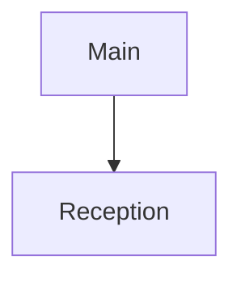

# Architecture Steward

## 第一原则

`ARCHITECTURE.md` 是架构域第一真源；本 skill 是 AI 修改该文件的唯一入口。

- 只记录会影响 fresh Implementer 如何放置代码、分配 owner、选择状态真源、守住边界或建立依赖的架构决定。
- 不管理 Spec、Ticket、施工顺序、代码规范或 Architecture Review；不把它们复制成第二份 Architecture。
- 可以整理用户、Spec 讨论、技术讨论、Implement/Review 暴露的架构候选，但不自行决定新架构，不自行把候选标为已确认。

## 内容域门禁

候选来源不参与归属判断；用户、Spec、Ticket、代码、对话或 Review 都可能提出 Architecture candidate。
写入任何 `[ ]` 候选前，AI 先拆开其中可独立判断的语义。每条写入内容必须同时满足：

1. 主要定义代码的结构关系：owner、状态真源、职责边界、依赖方向，或数据 / 控制流如何跨结构流动；
2. 是当前确实要建立或改变的架构决定，而不是代码现状复述、已有 Architecture 的重复内容或与当前决定无关的结构事实。

再用 fresh Implementer 反事实复核：

> fresh Implementer 如果不知道它，会不会更容易把代码放错位置、给错 owner、制造错误状态真源、穿透错误边界或形成错误依赖？

只有两项都成立才进入 Architecture。字段或 DTO 语义、业务行为、Ticket 范围、字段映射、具体文件 / 函数
落点和普通实现偏好，即使重要或影响实现，也留在职责相符的 Spec、Ticket 或 Rules；它们因语义归属被
过滤，而不是因其来自 Spec 或 Ticket。单独的“不要新增某种
实现”不因是否定句自动成为架构；只有它明确表达了 owner、边界或依赖关系时，才提取该结构语义。

候选混合了多类内容时，只提取其中能独立成立的结构语义；提取后，每个可独立确认或变更的结构语义分别
写成一条 `[ ]`，不因它们来自同一句或同一 Ticket 而合并。例如，同一交互同时约束命令写入路径和状态
读取路径时，只要两者可以分别改变，就分别成条。AI 负责完成这次内容分类；人的 `[x]` 只确认通过门禁后
的架构设计，不负责判断一句话算不算架构。

若同一候选存在两种合理解读，导致 AI 无法可靠判断是否属于架构域，不静默过滤，也不直接写入；单独列出
不同解读及缺少的结构关系，请人澄清意图后，再由 AI 重新分类。

## 定位文件

- 优先使用用户或上游明确给出的 `ARCHITECTURE.md` 路径。
- 已明确当前需求 Spec 时，可把 `<Spec 所在目录>/ARCHITECTURE.md` 作为唯一默认候选；不根据代码目录、changed files 或仓库扫描猜测。
- 路径不明时先请人指定。读到同名文件不等于它已被确认为某个 Task 的 Architecture Authority。

## 确认单元

Architecture 不设固定栏目，但每个架构决定都有显式确认状态。

### 文字决定

每个可独立变更的架构语义使用一条原子 checklist：

```markdown
- [ ] Reception 负责单聊过程、FIFO 和买家响应调度。
```

不把可独立确认、独立变更的 owner、状态真源或边界打包进同一条。

### 架构图

每张 Mermaid 图是一个确认单元，在图前使用一条确认项：

````markdown
## 架构总览

- [ ] 已确认


````

节点关系、依赖方向、层次或 owner 发生语义变化时重新打开该图；只改排版、文字位置或不改语义的标签不重新确认。某张图经常被局部变化打开时，再按真实独立决定拆小。

## 修改协议

| 动作 | 写入结果 | 人确认后 |
| --- | --- | --- |
| 创建 | 所有图和原子决定初始为 `[ ]` | 只把本次明确确认的单元改为 `[x]` |
| 新增 | 新单元写为 `[ ]` | 该单元改为 `[x]` |
| 语义修改 | 替换原文，仅把实际变更的 `[x]` 改为 `[ ]` | 该单元改为 `[x]` |
| 非语义编辑 | 保持原 `[x]` / `[ ]` | 无需重新确认 |
| 删除已确认决定 | 先改成 `- [ ] 删除：<原决定>` | 人确认该删除后才真正移除 |

已确认且未变更的 `[x]` 始终保持不动。未确认单元从未成为 Authority，可在人的明确指令下直接改写或移除。

## 人工确认门禁

1. 写入变更后重读文件，只展示当前 `[ ]` Architecture Delta 及必要上下文。
2. 写入请求、早先讨论、负责人曾表示过方向，都不等于对写入后当前 Delta 的确认。即使被要求“直接改完继续”，也先保留 `[ ]` 并展示 Delta。
3. 只有人在看到当前 Delta 后明确确认的单元，才改为 `[x]`；确认删除则直接移除对应 `删除：` 项。
4. 应用确认前再次重读文件。如展示后 Delta 已变化，不沿用旧确认，重新展示当前 Delta。
5. 文件中仍有任何 `[ ]` 时，明确返回“Architecture 尚未全部确认”；不允许用默认认可、进度压力或实现已完成替代确认。

## 边界与返回

其它环节发现 Task 必须改变 Architecture 时，它们只能返回具体的现有决定、缺口或候选 Delta；本 skill 按上述协议写入并等待人确认。

每次返回只说明：

- Architecture 文件路径；
- 实际写入的图或原子决定；
- 被过滤或待澄清的候选及其职责归属（如有）；
- 当前 `[ ]` Delta；
- 是否已全部确认。

不创建 CLI、scripts、Architecture JSON、item ID、revision/version、hash、registry、ledger、tombstone 或独立 review 工件。

## 常见错误

| 错误理由 | 处理 |
| --- | --- |
| “负责人已经决定，所以修改后仍可 `[x]`” | 语义变更先变为 `[ ]`；写入后的 Delta 必须再被明确确认。 |
| “删掉更干净，Git 还能查历史” | 已确认内容先写 `- [ ] 删除：...`，确认后再移除。 |
| “顺便把功能需求和施工顺序补齐” | 它们分别留在 Spec 和 Ticket；Architecture 只保留结构决定。 |
| “都很重要，先全写成 `[ ]` 让人筛” | AI 先做内容域门禁；人的 `[x]` 只确认架构设计。 |
| “要保证流程，应再加状态文件” | `[ ]` / `[x]` 就是第一版唯一确认机制。 |

## 红旗

- 语义改了却保留 `[x]`；
- 静默删除已确认内容；
- 用代码、diff 或 reference implementation 自行决定新架构；
- 在文件中仍有 `[ ]` 时声称 Architecture 已闭合；
- 为确认流程增加 ID、hash、ledger 或另一份状态。

出现任一项时停止扩展操作，恢复为未确认 Delta，只等待人对当前 Delta 作决定。
