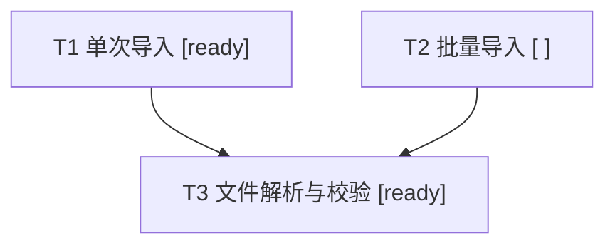

# Ticket 拆分评审与记录

评审已有 Ticket 的拆分质量，只写当前需求的 `decomposition.md`。Spec、Ticket 及必要项目上下文均为只读依据；不创建、修改或重拆 Ticket，不调度、执行、集成或维护执行状态。

可读取 wayfinder、to-spec、to-tickets 的产物，不依赖特定工具格式，也不主动调用这些 skill。

## 输入与记录位置

读取本轮评审范围、Spec 引用、已有 Ticket 与拆分记录、需求标识；沿用来源 ID、目标和引用，不复制完整 Spec 或 Ticket 正文。

记录固定为 `<feature-workspace>/decomposition.md`，依次使用调用方指定目录、来源或现有记录能确认的需求 workspace；尚无 workspace 但 feature 标识已确认时，按需创建项目根目录下的 `.scratch/<feature>/`。

同一需求只维护一份记录，复审更新原文件；沿用已确认的 feature 标识，不改变上游文件位置，也不写入 skill 安装目录。无法唯一定位或位置冲突时，返回未保存的 Markdown 草稿并说明原因，保留现有文件。

## 关系与粒度

所有节点都是 Ticket，同一 ID 表示同一项工作。两类关系分别按来源确认，缺失或存疑的关系列为待确认问题：

* **分解关系**：父项 → 子项，表示工作承接；来源确认的多个父项可以共享同一子项。
* **执行前置关系**：前置方 → 依赖方，说明所需交付及依据；可以跨分解分支。

粒度只使用以下标记：

| 标记 | 判定 |
| --- | --- |
| 留空 | 材料不足，或旧结论失效后无法恢复有效判断；记录缺口 |
| `ready` | 有依据证明当前范围是一个聚焦、可一次实现并独立验证的闭环 |
| `needs-split` | 仍有多个可分别实现和验证的闭环，指出至少两个作为依据 |

`ready` 不授予执行许可，也不表示依赖满足、问题全部解决或 Ticket 完成。覆盖缺口、依赖错误、过度拆分等问题单独记录。

## 评审与更新

1. **还原与核对结构**：首次读取整体；复审读取变更及受影响的父项、子项和依赖方。检查原始要求是否由子项或父项剩余工作承接，有无遗漏、非预期的重复实现、错误归属或执行前置环。父项仍可能承担集成、补缺和整体验收；范围缺失时记录缺口，子项完成不自动证明父项完成。
2. **确定待评范围**：评审 Ticket 届时实际执行的工作。无子项时看自身范围；有子项时按约定交付检查当前 Ticket 的剩余范围。共享子项按同一份交付评估，各父项分别判断自己的剩余工作；约定交付不等于已经完成。
3. **判断粒度**：主要工作须围绕同一个状态或生命周期，并在同一行为边界验证。若至少两个部分能分别实现、验证，且一个缺失或错误时另一个仍有独立完成价值，优先判 `needs-split`。具有各自成功、失败和恢复规则的状态机、生命周期、事务或交互机制通常属于此类；仅当保持原行为契约使其无法独立实现和验证时，才保留在同一 Ticket。

   同一机制的场景、异常与边界可分别失败，不因此拆分。不以文件数、行数、验收项、Spec 或场景数量设硬阈值；拆到仅剩无独立实现和验证意义的技术步骤时停止。

4. **确定调整方式**：对 `needs-split`，根据各部分交付后原 Ticket 是否仍有独立且有意义的工作，向 `to-tickets` 明确交接：

   | 原 Ticket 的剩余工作 | 调整方式 |
   | --- | --- |
   | 仍有统一集成、组合验证或整体验收 | 拆为子 Ticket，保留父项 |
   | 各部分独立完成和验收后，没有额外整体行为 | 重新划分 Ticket，不保留人为父项 |

5. **更新记录**：更新受影响的结构、粒度和问题，保留无关记录。来源变化时重评，无法恢复有效判断则清空标记；旧问题只有新材料证明已解决才移除。分别表达来源事实、评审结论和调整建议；建议涉及的关系待实际 Ticket 调整后复审纳入正式结构。

## 记录与回复

记录使用 Markdown 与 Mermaid，包含来源引用、分解关系、执行前置和评审发现；每条关系附来源依据。

默认用一张 Mermaid 有向图展示分解关系，每个 Ticket 只画一个节点，标注 ID、短标题和粒度。执行前置使用文字列表；需要分析复杂阻塞链路时，可另画执行前置图。

例：来源确认 T1、T2 共享子项 T3，T9 仅提供执行前置接口：

* T3 → T1、T2：提供同一份文件解析与校验输出。
* T9 → T1、T2：提供导入权限查询接口。
* 评审发现：T2 的部分失败处理契约缺失，粒度留空。

评审发现只记录需要处理的问题，已由粒度标记表达的结论无需复述。`needs-split` 的发现中写明依据、调整方式及交给 `to-tickets` 的具体对象。

回复说明记录位置或未保存草稿、主要变化、未解决问题及后续动作。
